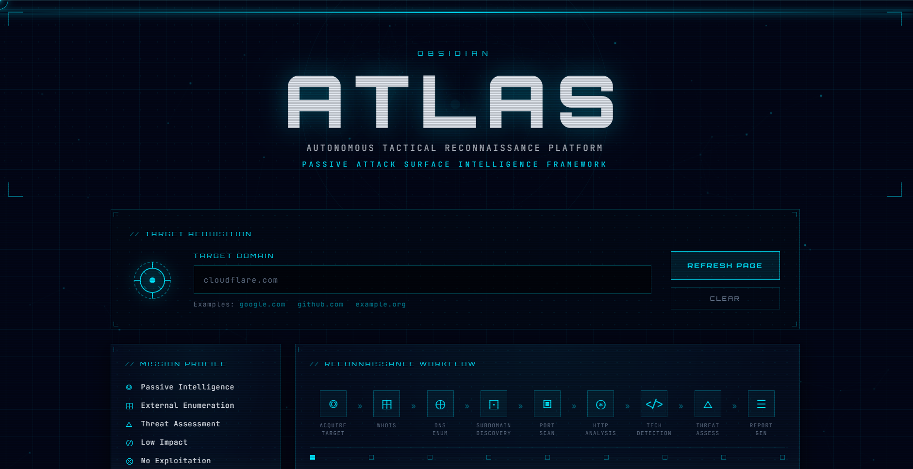
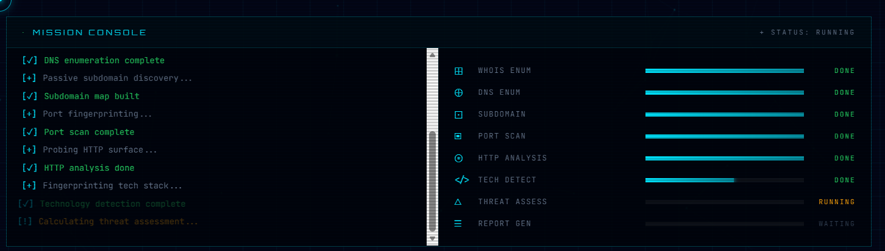
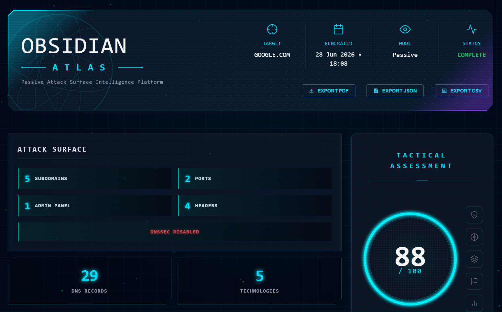
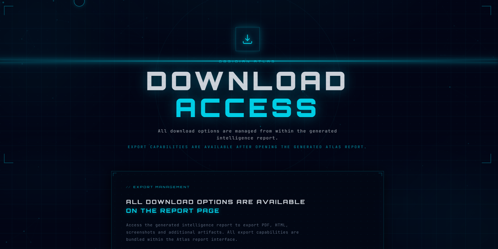
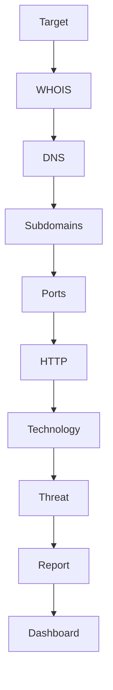

<div align="center">

# OBSIDIAN ATLAS

### Passive Attack Surface Intelligence Framework

> **Know the surface before the adversary does.**

<br>



<br>


</div>

---

# Overview

**OBSIDIAN ATLAS** is a modular passive reconnaissance and attack surface intelligence framework built for automated external target enumeration.

The framework consolidates multiple reconnaissance modules into a unified tactical dashboard capable of collecting publicly available intelligence, analysing attack surface exposure, identifying technologies, evaluating HTTP security posture, and generating professional intelligence reports.

Designed around a modular architecture, each reconnaissance engine operates independently while contributing to a centralized reporting pipeline.

---

# Live Demonstration

🎥 **Project Walkthrough**

> Click below to watch the complete project demonstration.

[▶ Watch Demo Video](assets/demo_compressed.mp4)
```

---

# Dashboard Preview

## Tactical Dashboard

<p align="center">

</p>

---

## Mission Console

<p align="center">

</p>

---

## Intelligence Report

<p align="center">

</p>

---

## Download Center

<p align="center">

</p>

---

# Core Capabilities

| Module | Description |
|---------|-------------|
| WHOIS Intelligence | Domain registration intelligence |
| DNS Enumeration | Infrastructure mapping |
| Passive Subdomain Discovery | Attack surface expansion |
| Port Enumeration | External service exposure |
| HTTP Fingerprinting | Response analysis & security headers |
| Technology Detection | Web stack identification |
| Threat Assessment | Risk scoring & prioritisation |
| Dashboard | Interactive tactical interface |
| Reporting | HTML Intelligence Report |
| Export Engine | PDF, JSON & CSV export |

---

# Reconnaissance Workflow



---

# Why OBSIDIAN ATLAS

- Passive Reconnaissance
- Modular Architecture
- Interactive Tactical Dashboard
- Modern Cyberpunk Interface
- Professional Intelligence Reports
- Multiple Export Formats
- Educational & Defensive Focus
- Lightweight Flask Backend

---

# Features

## Passive Intelligence Collection

Collects publicly available intelligence without aggressive interaction with the target infrastructure.

### WHOIS Intelligence

- Registrar
- Creation Date
- Expiration Date
- Name Servers
- DNSSEC
- Registration Status

---

### DNS Enumeration

Supports

- A Records
- AAAA Records
- MX Records
- TXT Records
- NS Records
- CNAME Records

---

### Passive Subdomain Discovery

Discovers publicly indexed subdomains using passive intelligence techniques.

---

### Port Enumeration

Identifies externally exposed services.

---

### HTTP Fingerprinting

Collects

- Response Headers
- Status Code
- Response Time
- Cookies
- Security Headers

---

### Technology Detection

Identifies

- Web Server
- HTTP Protocol
- Compression
- Framework Indicators
- Security Technologies

---

### Threat Assessment

Generates

- Attack Surface
- Risk Score
- Threat Factors
- Confidence
- Priority
- Exposure Summary

---

# Interactive Dashboard

The generated HTML dashboard includes

- Executive Summary
- Attack Surface Metrics
- Tactical Assessment
- WHOIS Intelligence
- DNS Records
- HTTP Analysis
- Security Headers
- Cookie Inspection
- Technology Profile
- Threat Factors
- Export Center

---

# Export Formats

- HTML
- PDF
- JSON
- CSV

---

# Project Structure

```text
ReconToolkit/

├── launcher.py
├── main.py
├── requirements.txt
├── start_atlas.bat

├── modules/
│   ├── whois_enum.py
│   ├── dns_enum.py
│   ├── subdomain_enum.py
│   ├── port_scan.py
│   ├── http_fingerprint.py
│   ├── tech_detect.py
│   └── report_generator.py

├── templates/
├── static/
├── reports/
└── wordlists/
```

---

# Installation

Clone the repository

```bash
git clone https://github.com/ranveer-codes-this/obsidian-atlas-recon-toolkit.git
```

Move into the project

```bash
cd obsidian-atlas-recon-toolkit
```

Install dependencies

```bash
pip install -r requirements.txt
```

Launch

```bash
python launcher.py
```

or

```bash
start_atlas.bat
```

---

# Technology Stack

### Backend

- Python
- Flask

### Frontend

- HTML
- CSS
- Vanilla JavaScript
- Jinja2

### Libraries

- requests
- dnspython
- python-whois
- BeautifulSoup
- socket
- ssl

---

# Intended Usage

This framework is intended for

- Educational Purposes
- Defensive Reconnaissance
- Security Research
- Internal Security Assessments

---

# Roadmap

- [ ] ASN Enumeration
- [ ] SSL Certificate Analysis
- [ ] WAF Detection
- [ ] Wayback Machine Integration
- [ ] Shodan Integration
- [ ] CVE Correlation
- [ ] Screenshot Engine
- [ ] Docker Support
- [ ] REST API
- [ ] Plugin System

---

# Disclaimer

This project is intended solely for authorised security assessments, educational purposes, and defensive reconnaissance.

Only analyse systems that you own or have explicit permission to assess.

The developers assume no responsibility for misuse of this software.

---

<div align="center">

## OBSIDIAN ATLAS

Passive Attack Surface Intelligence Framework

**Version 1.0.0**


Built for Ethical Hacking, Security Research and Attack Surface Intelligence.

</div>
